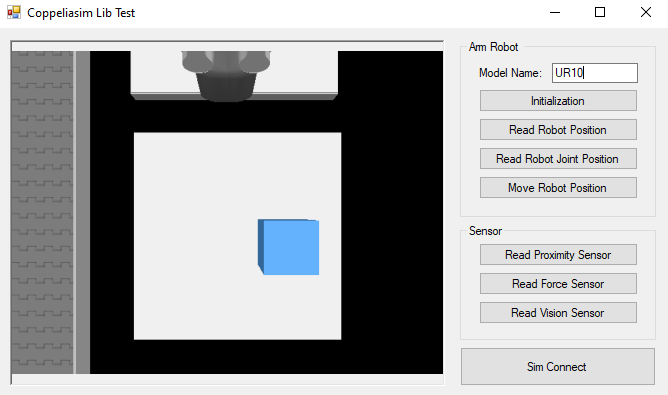
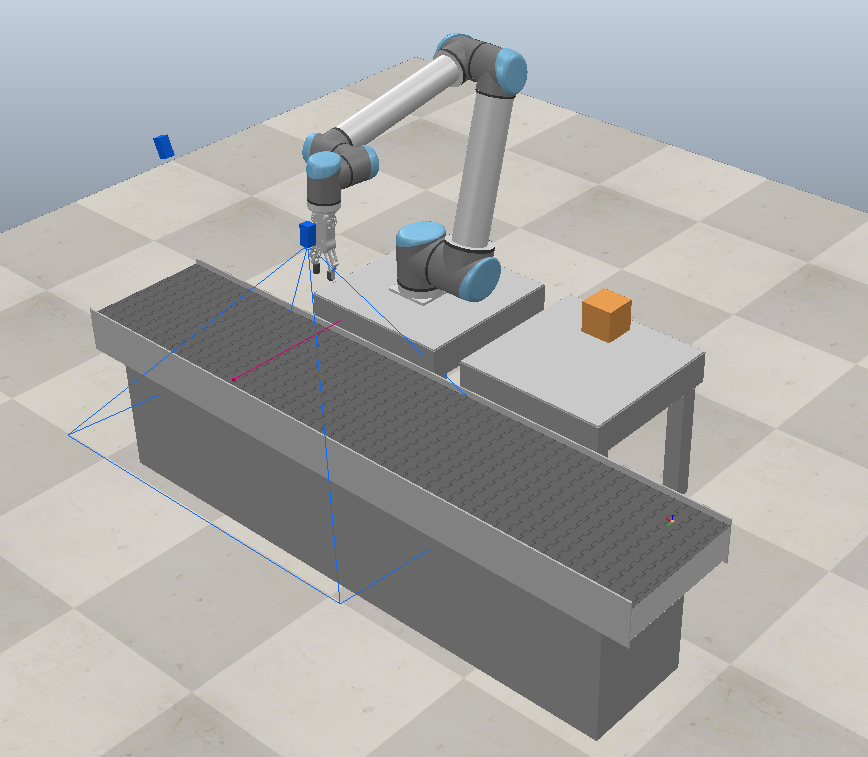
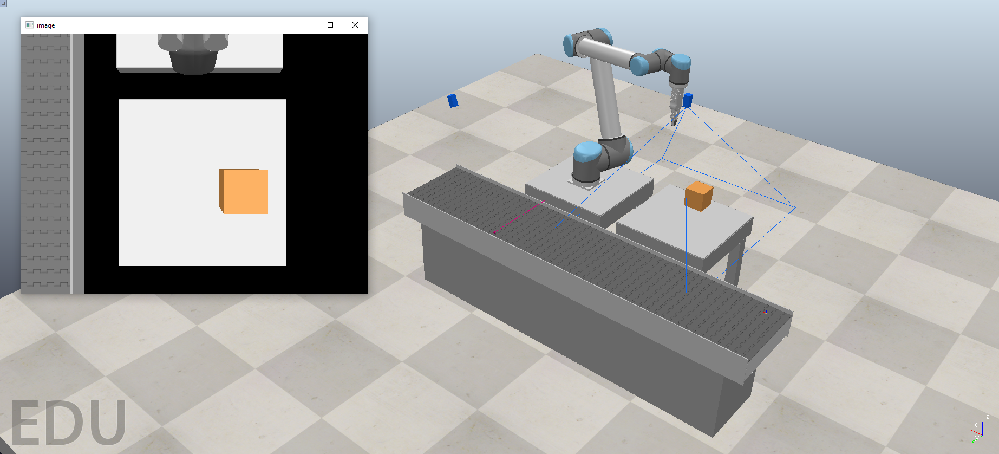

# coppeliasim-opencv
A coppelisim library that support integration with several type of robots and sensors such as vision sensor, proximity sensor, and force sensor. This project is particularly focused on the intergration between Coppeliasim vision sensor and opencv C++ library.

## Simulation

